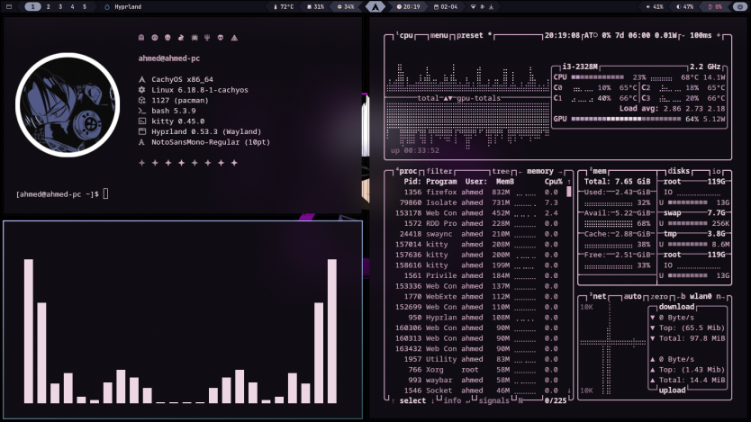

# Hyprland Dotfiles



سيتاب Hyprland شخصي مبني على **Catppuccin** — نظيف، سريع، قابل للتخصيص.

---

## 🖥️ المكونات

| المكوّن | الأداة |
|---------|--------|
| Compositor | Hyprland |
| Bar | Waybar |
| Launcher | Rofi (wayland) |
| Terminal | Kitty |
| Notifications | SwayNC |
| Wallpaper | swww |
| Lock Screen | Hyprlock + Hypridle |
| Shell Prompt | Starship |
| File Manager | Nautilus |
| Clipboard | cliphist |

---

## ✨ الميزات

### 🎨 نظام الثيمات
تغيير الثيم بضغطة واحدة من **Menu → Style** يطبّق فوراً على:
- Waybar · SwayNC · Kitty · Rofi · btop

**الثيمات المتاحة:** `catppuccin-mocha` · `catppuccin-frappe` · `catppuccin-macchiato` · `catppuccin-latte`

---

### 󰸉 قائمة الخلفيات (`Super + I`)

| الخيار | الوظيفة |
|--------|---------|
| 󰸉 Desktop Wallpaper | تغيير خلفية سطح المكتب + شاشة القفل معاً |
| 󰷛 Lock Screen Wallpaper | تغيير خلفية شاشة القفل فقط |
| 󰀄 Account Avatar | تغيير صورة الحساب في شاشة القفل |
| 󰑓 Random Wallpaper | خلفية عشوائية |
| 󰹑 Set per Monitor | تعيين خلفية مختلفة لكل شاشة |
| 󰋩 Open Wallpaper Folder | فتح مجلد الخلفيات |

> الخلفيات تُقرأ من `~/Wallpapers/Pictures/` وتظهر مع thumbnail مصغّر لكل صورة.
> صور الحساب تُقرأ من `~/Wallpapers/Users/`.

---

### 󰅍 الحافظة (`Super + V`)

- **نصوص** → واجهة rofi الكلاسيكية
- **صور** → تظهر كـ thumbnails مع معاينة
- **خليط** → يسألك أولاً: نصوص أم صور؟

---

### 󰷛 شاشة القفل (`Super + Shift + Backspace`)

- الخلفية هي آخر خلفية اخترتها (محفوظة تلقائياً مع blur)
- الوقت والتاريخ في المنتصف
- صورة الحساب وحقل كلمة المرور
- مؤشر الفأرة ظاهر

---

### 󰀻 قائمة Rofi الرئيسية

| الخيار | الوظيفة |
|--------|---------|
| 󰕰 Apps | App launcher كامل مع أيقونات |
| 󰒓 Style | تغيير الثيم لكل التطبيقات |
| 󰄠 Install | تثبيت الحزم |
| 󰗼 Remove | حذف الحزم |
| 󰑓 Update | تحديث النظام |
| ⏻ System | Lock · Logout · Suspend · Reboot · Shutdown |

---

## ⚙️ التثبيت

### تلقائي

```bash
git clone https://github.com/b2-3c/dotfiles
cd dotfiles
bash install.sh
```

أو مباشرة:

```bash
bash -c "$(curl -fsSL https://raw.githubusercontent.com/b2-3c/dotfiles/main/install.sh)"
```

> المثبّت يتعامل مع كل شيء: تثبيت الحزم، نسخ الملفات، ضبط الصلاحيات، تفعيل الخدمات، وضع الخلفية وصورة الحساب الافتراضية.

### يدوي

```bash
git clone https://github.com/b2-3c/dotfiles
cd dotfiles

cp -r .config/* ~/.config/

mkdir -p ~/Pictures/Screenshots ~/Wallpapers/Pictures ~/Wallpapers/Users

find ~/.config/hypr/scripts    -type f              -exec chmod +x {} +
find ~/.config/hypr/nowplaying -type f -name "*.sh" -exec chmod +x {} +
find ~/.config/rofi/scripts    -type f -name "*.sh" -exec chmod +x {} +
find ~/.config/waybar/scripts  -type f              -exec chmod +x {} +
find ~/.config/swaync/scripts  -type f -name "*.sh" -exec chmod +x {} +

cp ~/.config/waybar/themes/catppuccin-mocha.css ~/.config/waybar/theme.css
cp ~/.config/rofi/themes/catppuccin-mocha.rasi  ~/.config/rofi/theme.rasi
cp ~/.config/swaync/themes/catppuccin-mocha.css ~/.config/swaync/theme.css
cp ~/.config/kitty/themes/catppuccin-mocha.conf ~/.config/kitty/theme.conf
```

---

## 📦 التبعيات

### أساسية
```
hyprland hyprlock hypridle hyprsunset hyprpicker
xdg-desktop-portal-hyprland xdg-desktop-portal-gtk
xorg-xwayland wayland-protocols qt5-wayland qt6-wayland
grim slurp grimblast-git swww swaync
wl-clipboard cliphist imagemagick
polkit-gnome sddm dbus udiskie
```

### الصوت
```
pipewire pipewire-pulse pipewire-alsa wireplumber
pamixer pavucontrol playerctl python-gobject
```

### الشبكة
```
networkmanager nm-connection-editor bluez bluez-utils rfkill
```

### الواجهة
```
waybar rofi-wayland rofi-calc rofi-emoji
brightnessctl upower jq curl fzf libnotify
```

### التطبيقات
```
kitty neovim starship nautilus firefox
btop fastfetch cava lazygit mpv obs-studio
```

### الخطوط والأيقونات
```
ttf-jetbrains-mono-nerd ttf-commit-mono-nerd
noto-fonts noto-fonts-emoji otf-font-awesome
papirus-icon-theme bibata-cursor-theme
```

---

## ⌨️ الاختصارات

> `$mod` = Super

### القوائم

| الاختصار | الوظيفة |
|----------|---------|
| `Super + A` | App launcher |
| `Super + V` | Clipboard |
| `Super + X` | Calculator |
| `Super + M` | Emoji picker |
| `Super + W` | Window switcher |
| `Super + I` | Wallpaper menu |
| `Super + P` | Now Playing |

### التطبيقات

| الاختصار | الوظيفة |
|----------|---------|
| `Super + T` | Terminal (Kitty) |
| `Super + C` | Code editor |
| `Super + E` | File manager (Nautilus) |
| `Super + F` | Browser (Firefox) |
| `Super + Shift + F` | Browser private window |
| `Super + Shift + N` | Toggle notifications |

### لقطات الشاشة

| الاختصار | الوظيفة |
|----------|---------|
| `Print` | منطقة محددة |
| `Super + Print` | الشاشة كاملة |
| `Super + Alt + Print` | النافذة النشطة |

### الصوت

| الاختصار | الوظيفة |
|----------|---------|
| `XF86AudioRaiseVolume` | رفع الصوت |
| `XF86AudioLowerVolume` | خفض الصوت |
| `XF86AudioMute` | كتم الصوت |
| `XF86AudioMicMute` | كتم الميكروفون |
| `Super + Alt + R/L` | رفع/خفض الصوت |
| `Super + Alt + M` | كتم الصوت |
| `XF86AudioPlay/Next/Prev` | تحكم بالمشغل |

### السطوع

| الاختصار | الوظيفة |
|----------|---------|
| `XF86MonBrightnessUp/Down` | رفع/خفض السطوع |
| `Super + Alt + U/D` | رفع/خفض السطوع |

### إدارة النوافذ

| الاختصار | الوظيفة |
|----------|---------|
| `Super + Q` | إغلاق النافذة |
| `Super + Return` | Fullscreen |
| `Super + Shift + W` | تعويم النافذة |
| `Super + \` | النافذة التالية |
| `Super + H/J/K/L` | تحريك التركيز |
| `Super + Arrows` | تحريك التركيز |
| `Super + Shift + H/J/K/L` | تغيير الحجم |
| `Super + S` | Special workspace |
| `Super + Shift + Drag` | سحب النافذة |
| `Super + Right Click` | تغيير الحجم بالماوس |

### مساحات العمل

| الاختصار | الوظيفة |
|----------|---------|
| `Super + 1-0` | الانتقال لمساحة 1-10 |
| `Super + Shift + 1-0` | نقل النافذة |
| `Super + Alt + 1-0` | نقل صامت |
| `Super + Ctrl + Left/Right` | مساحة سابقة/تالية |
| `Super + Ctrl + H/L` | مساحة سابقة/تالية |
| `Super + Ctrl + Down/J` | أول مساحة فارغة |

### النظام

| الاختصار | الوظيفة |
|----------|---------|
| `Super + Shift + Backspace` | قفل الشاشة |
| `Super + Ctrl + W` | إعادة تشغيل Waybar |
| `Super + Alt + B` | إيقاف Bluetooth |
| `Super + Alt + N` | إيقاف Wi-Fi |

---

## 📁 هيكل الملفات

```
~/.config/
├── hypr/
│   ├── hyprland.conf
│   ├── hyprlock.conf
│   ├── hypridle.conf
│   ├── custom/
│   │   ├── binds.conf         # الاختصارات
│   │   ├── exec.conf          # البرامج عند البدء
│   │   ├── monitors.conf      # ← عدّل هنا
│   │   ├── devices.conf       # ← عدّل هنا
│   │   ├── rules.conf
│   │   └── variables.conf
│   ├── scripts/
│   │   ├── lock.sh
│   │   ├── screenshot.sh
│   │   └── zoom.sh
│   └── nowplaying/
│       ├── nowplaying.sh
│       └── fallback_album_art.jpg
│
├── waybar/
│   ├── config.jsonc
│   ├── style.css
│   ├── theme.css              # ← يُنسخ من themes/
│   └── themes/
│
├── rofi/
│   ├── theme.rasi
│   ├── wallpaper-menu.rasi
│   ├── clipboard-image.rasi
│   └── scripts/
│       ├── wallpaper-menu.sh
│       └── rofi.sh
│
├── swaync/
├── kitty/
├── btop/
├── cava/
├── fastfetch/
└── starship.toml

~/
├── Wallpapers/
│   ├── Pictures/              # خلفيات سطح المكتب
│   └── Users/                 # صور الحساب
└── Pictures/
    └── Screenshots/
```

---

## ⚠️ إعدادات يدوية بعد التثبيت

| الملف | ما تحتاج تعديله |
|-------|----------------|
| `~/.config/hypr/custom/monitors.conf` | اسم الشاشة والدقة |
| `~/.config/hypr/custom/devices.conf` | اسم لوحة المفاتيح والماوس |
| `~/.config/waybar/scripts/weather.sh` | إحداثيات LAT و LON |

---

## 📝 ملاحظات

- الخلفية الافتراضية: `MistyTrees.jpg` — صورة الحساب: `avatar.png`
- عند تغيير الخلفية من القائمة تُحفظ تلقائياً لشاشة القفل أيضاً
- لقطات الشاشة تُحفظ في `~/Pictures/Screenshots/`
- نسخة احتياطية تُحفظ في `~/.config_backup_*` عند كل تثبيت

---

## 🤝 المساهمة

المقترحات والإصلاحات مرحّب بها — افتح Issue أو PR.
