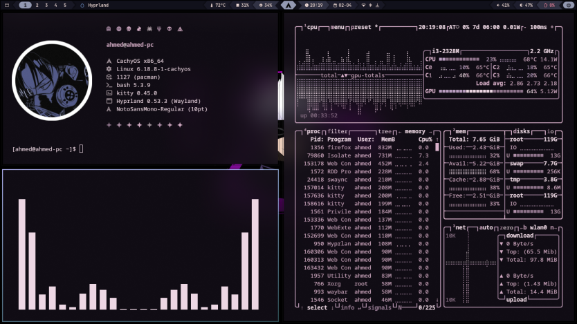
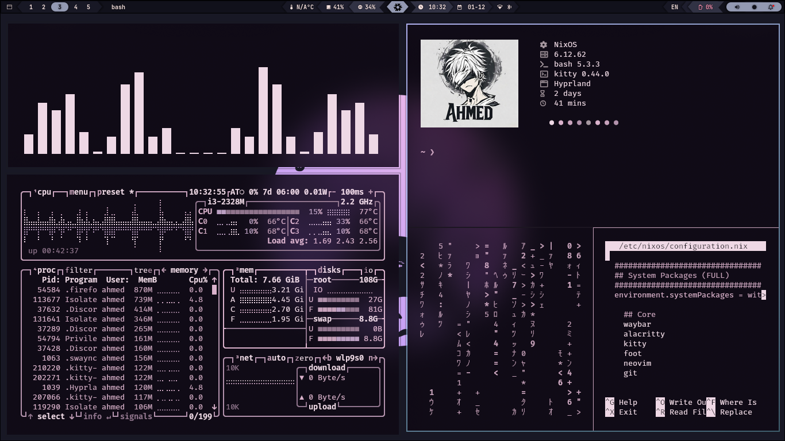
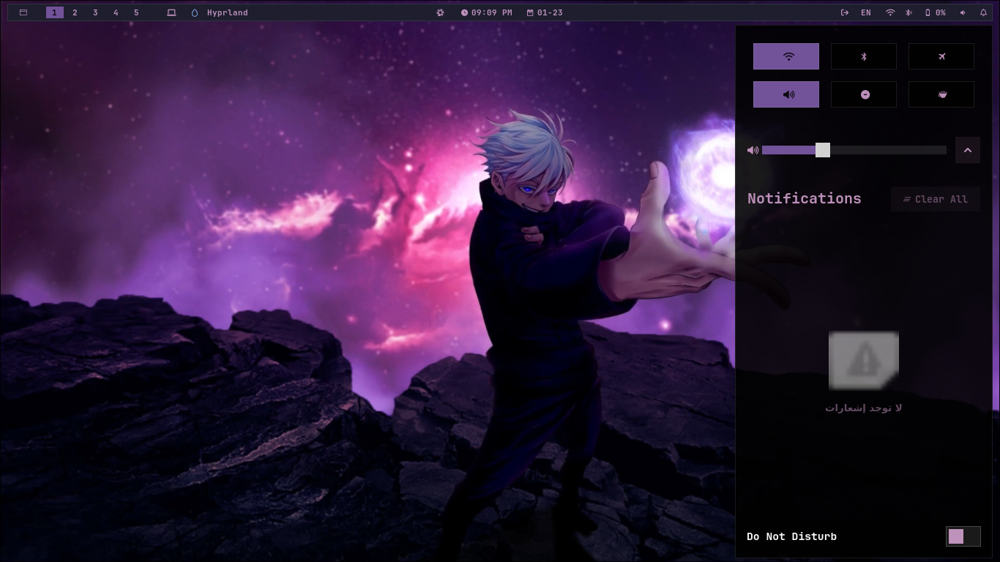

# Dotfiles – Hyprland

## Screenshots

<details>
<summary> Screenshots
</summary>




</details>


A personal **Hyprland + Waybar** dotfiles setup focused on a clean Wayland workflow.
These dotfiles are primarily tested on **NixOS**, but most parts should work on other Linux distributions with minimal adjustments.

---

## ✨ Features

* Hyprland (Wayland compositor)
* Modular Waybar configuration
* PipeWire-based audio stack
* Screenshot, recording, and color-picking utilities
* Dynamic wallpapers (image & video)
* SwayNC notifications
* Custom scripts and small Waybar extensions

---

## 📦 Dependencies

Below is a **non-exhaustive but required** list of programs needed for everything to work as intended.

### System Basics & Wayland

* hyprland
* waybar
* wayland
* xorg.xwayland
* dbus
* systemd (user)
* xdg-desktop-portal
* xdg-desktop-portal-hyprland

### Audio & Microphone

* pipewire
* pulseaudio
* pipewire-pulse
* wireplumber
* pamixer
* pavucontrol
* playerctl

### Networking

* networkmanager
* nm-connection-editor

### Screenshots & Recording

* grim
* slurp
* wl-clipboard
* hyprshot
* wf-recorder
* hyprpicker

### Wallpapers

* swaybg

### Notifications

* swaync
* swaync-client
* libnotify (`notify-send`)

### Brightness & Power

* brightnessctl
* upower

### Scripting & CLI Tools

* bash
* python3
* python-dbus **or** python-dbus-next
* curl
* jq
* coreutils
* procps

### Media

* spotify (optional)

> Uses `playerctl` for Waybar integration

### Essential Applications

* alacritty
* nautilus
* firefox
* neovim
* btop
* unimatrix
* lazygit
* fastfetch

### Fonts & Icons (**Important**)

* nerd-fonts
* noto-fonts
* noto-fonts-emoji
* font-awesome


---

## 🧩 NixOS-Specific Requirements

If you are using **NixOS**, make sure you also have:

* polkit
* polkit-gnome (or another Polkit agent)

---

## ⚠️ Installation

> **Warning:** These dotfiles are not plug-and-play and may overwrite your existing configuration.

### Manual Installation (Classic Dotfiles Style)

```bash
git clone https://github.com/b2-3c/dotfiles
cd dotfiles

# Config files
cp -r .config/* ~/.config/

# Custom scripts
mkdir -p ~/.local/share/custom/bin
chmod +x custom-scripts/*
cp custom-scripts/* ~/.local/share/custom/bin/

# Wallpapers
mkdir -p ~/.config/current/Wallpapers
mkdir -p ~/Wallpapers/Pictures   # Put image wallpapers here
mkdir -p ~/Wallpapers/Videos     # Put mp4 wallpapers here
```
---

## ❗ Important Notes

* **Back up your system before copying anything**
* Existing files in `~/.config` **will be overwritten** if names collide
* I am **not responsible** for broken setups or lost configurations

---

## 📝 Notes & Credits
* GTK CSS is experimental and slightly broken — improvements are welcome
---

## 🤝 Contributions

Suggestions, fixes, and improvements are welcome. Feel free to open an issue or PR.
